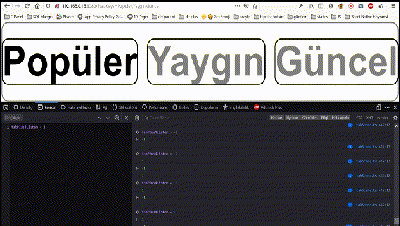

  [i use phaser3 typescript template repository from](https://github.com/yandeu/phaser-project-template#readme) for using Phaser3 with typescript.
  <br>
  Phaser 3 Based Menu
  <br>

## Sample


## How To Use


```bash
# Clone this repository
$ git clone  https://github.com/inceabdullah/Phaser3-Based-Menu-Button-Maker.git

# Go into the repository
$ cd Phaser3-Based-Menu-Button-Maker

# Install dependencies
$ npm install

# if webpack is not installed:
$ npm install webpack webpack-dev-server -g

# Start the local development server (on port 8080)
$ npm start

# or

$ webpack-dev-server --config webpack/webpack.dev.js

# Ready for production?
# Build the production ready code to the /dist folder
$ npm run build
```

Change the **tabs** in *tabKeys* parameter. like: `http://localhost:8080/?tabKeys=menu1,menu2,menu3`

the function of for spliting tabKeys in globalVars.ts:

    this.tabKeys = searchParams.get("tabKeys");
    
    this.tabKeys = {
                keys: this.parseKeys(this.tabKeys), // arrayed}
                number: this.parseKeys(this.tabKeys).length,
                joinedKeys: this.parseKeys(this.tabKeys).join(" ") // default char: space
             }
    
    
    parseKeys = (tabKeys: string) => {
        const _splitted = tabKeys.split(",")
        return _splitted;
    }

## Using with React Native

it is recommended to use in **WebView**, to be responsive, Phaser Game config is adjusted like below:
```javascript
      const config: GameConfig = {
      		scale: {
        		mode: Phaser.Scale.FIT
    		}
    	}
```

and of course:
```javascript
      DEFAULT_WIDTH = window.innerWidth * window.devicePixelRatio
      DEFAULT_HEIGHT = window.innerHeight * window.devicePixelRatio
```
**Noted that**: using without **window.devicePixelRatio** ratio causes to mismatchinf of canvas and webview browser dimensions.

## Phaser3 Tab Menu Communication with React Native WebView by postMessage



the variable `tabPlus4Listen` is on the [index.html](src/index.html) on Phaser3 Button page as:

```javascript
    <script type="text/javascript">      
    var tabPlus4Listen = 0;
    </script>
```

Listening to global variable changing is in `update()` function in [Phaser.Scene](src/scripts/scenes/tabScene.ts) as:

```javascript
  _tabPlusListen = () => {
    if ( window.tabPlus4Listen === 0 ){ return }
    let newSelection = selectedTabOrder+window.tabPlus4Listen
    window.tabPlus4Listen = 0;
    if (newSelection === tabKeysObjects_.length){ newSelection = 0 }
    if (newSelection === -1){ newSelection = tabKeysObjects_.length-1}
    
    this._likeTouch(newSelection)

  }
```

After changing, Phaser send message to `React Native` app with `postMessage` like below:
```javascript
window.postMessage(`{"JSONED_selectedTabNumber":${selectedTabOrder}}`);
```

*Note:* Sure thing, `window.postMessage()` won't work before changing this function into `window.ReactNativeWebView.postMessage()`

Sending +1 or -1 triggering to Phaser is happened with changing the global variable `tabPlus4Listen` via `WebView JavaScript Injection`:
```javascript
        this.webViewRefOfPhaserTab.injectJavaScript(`tabPlus4Listen=${-direction};true;`)

```

to prevent tab animation function from multiple triggering is added a variable `lockOfTouchedOnScreen`:
```javascript
  _touchedOnScreen = (pointer, gameObject) => { if (lockOfTouchedOnScreen){ return } 

    selection = tabKeysObjects_.indexOf(gameObject)

    if (selection === selectedTabOrder) { return }

    lockOfTouchedOnScreen = true

    this._switchRectangleStrokes("", false)
    //console.log(gameObject)
    //console.log(tabKeysObjects_.indexOf(gameObject))

    this._rectangleAnimation(selection)

  }
```

This variable is used when animated rectangles is moving in `update()` function:
```javascript
update(){
if (lockOfTouchedOnScreen){
      
      this._checkPos();
    }

}

  _checkPos = () => {

      if ( tabRectangles_.length === 0){ return }
      if (wayOfDirection === 1){
        if (tabRectangles_[selectedTabOrder].x >= selectionX){ this._afterRectangleAnimation() }
        }else{
          if (tabRectangles_[selectedTabOrder].x <= selectionX){ this._afterRectangleAnimation() }
        }
  }


```


## Loading from WebView

if page is loading immediatelly after running app, canvas width and height size from browser will be zero.

for solving, webview height should be above zero before loading page.

              <View
                onLayout = {(event) => {
    
                  if (event.nativeEvent.layout.height >= 0){
                    this.setState({
                      tabWebViewUri: {
                        0: this.state.tabWebViewUri[1]
                      }
                    
                    });
                  }
                   }}>
                    <WebView
                    style = {{
                      height: tabs.Hieght,
                      width: screenWidth,
                      
                    }}
                    source = {{
                      uri: this.state.tabWebViewUri[0]
                    }}
                    scalesPageToFit={false}
                    />
                  </View>


You know when *this.state* changed, WebView.souce.uri will be changed, then load new uri

        this.state = { 
    	    tabWebViewUri: {
          		0: null,
          		1: `${tabs.uriBase}?w=${screenWidth}&h=${tabs.Hieght}&												tabKeys=${encodeURI(tabs.keys[0]+","+tabs.keys[1]+","+tabs.keys[2])}`
        },                  

i use this React Native code for [Haber Tellali App](https://github.com/inceabdullah/Haber-Tellali-3th-Wave-News-Service/blob/master/react-native/expo-typescript/App.tsx)   


There are some errors when it is working:
```bash

ERROR in C:\Users\bill\git\phaser-project-template\src\scripts\scenes\tabScene.ts
./src/scripts/scenes/tabScene.ts
[tsl] ERROR in C:\Users\bill\git\phaser-project-template\src\scripts\scenes\tabScene.ts(293,37)
      TS2339: Property 'rexRoundRectangle' does not exist on type 'GameObjectFactory'.

ERROR in C:\Users\bill\git\phaser-project-template\src\scripts\scenes\tabScene.ts
./src/scripts/scenes/tabScene.ts
[tsl] ERROR in C:\Users\bill\git\phaser-project-template\src\scripts\scenes\tabScene.ts(384,34)
      TS2339: Property 'rexRoundRectangle' does not exist on type 'GameObjectFactory'.

ERROR in C:\Users\bill\git\phaser-project-template\src\scripts\scenes\tabScene.ts
./src/scripts/scenes/tabScene.ts
[tsl] ERROR in C:\Users\bill\git\phaser-project-template\src\scripts\scenes\tabScene.ts(386,35)
      TS2339: Property 'rexRoundRectangle' does not exist on type 'GameObjectFactory'.

ERROR in C:\Users\bill\git\phaser-project-template\src\scripts\scenes\tabScene.ts
./src/scripts/scenes/tabScene.ts
[tsl] ERROR in C:\Users\bill\git\phaser-project-template\src\scripts\scenes\tabScene.ts(402,44)
      TS2339: Property 'x' does not exist on type 'Rectangle | GameObject'.
  Property 'x' does not exist on type 'GameObject'.

ERROR in C:\Users\bill\git\phaser-project-template\src\scripts\scenes\tabScene.ts
./src/scripts/scenes/tabScene.ts
[tsl] ERROR in C:\Users\bill\git\phaser-project-template\src\scripts\scenes\tabScene.ts(406,37)
      TS2339: Property 'velocity' does not exist on type 'object | Body | Body'.
  Property 'velocity' does not exist on type 'object'.

ERROR in C:\Users\bill\git\phaser-project-template\src\scripts\scenes\tabScene.ts
./src/scripts/scenes/tabScene.ts
[tsl] ERROR in C:\Users\bill\git\phaser-project-template\src\scripts\scenes\tabScene.ts(414,37)
      TS2339: Property 'velocity' does not exist on type 'object | Body | Body'.
  Property 'velocity' does not exist on type 'object'.

ERROR in C:\Users\bill\git\phaser-project-template\src\scripts\scenes\tabScene.ts
./src/scripts/scenes/tabScene.ts
[tsl] ERROR in C:\Users\bill\git\phaser-project-template\src\scripts\scenes\tabScene.ts(423,12)
      TS2554: Expected 2-3 arguments, but got 1.

ERROR in C:\Users\bill\git\phaser-project-template\src\scripts\scenes\tabScene.ts
./src/scripts/scenes/tabScene.ts
[tsl] ERROR in C:\Users\bill\git\phaser-project-template\src\scripts\scenes\tabScene.ts(445,46)
      TS2339: Property 'x' does not exist on type 'Rectangle | GameObject'.
  Property 'x' does not exist on type 'GameObject'.

ERROR in C:\Users\bill\git\phaser-project-template\src\scripts\scenes\tabScene.ts
./src/scripts/scenes/tabScene.ts
[tsl] ERROR in C:\Users\bill\git\phaser-project-template\src\scripts\scenes\tabScene.ts(447,48)
      TS2339: Property 'x' does not exist on type 'Rectangle | GameObject'.
  Property 'x' does not exist on type 'GameObject'.

ERROR in C:\Users\bill\git\phaser-project-template\src\scripts\scenes\tabScene.ts
./src/scripts/scenes/tabScene.ts
[tsl] ERROR in C:\Users\bill\git\phaser-project-template\src\scripts\scenes\tabScene.ts(452,17)
      TS2339: Property 'tabPlus4Listen' does not exist on type 'Window & typeof globalThis'.

ERROR in C:\Users\bill\git\phaser-project-template\src\scripts\scenes\tabScene.ts
./src/scripts/scenes/tabScene.ts
[tsl] ERROR in C:\Users\bill\git\phaser-project-template\src\scripts\scenes\tabScene.ts(453,48)
      TS2339: Property 'tabPlus4Listen' does not exist on type 'Window & typeof globalThis'.

ERROR in C:\Users\bill\git\phaser-project-template\src\scripts\scenes\tabScene.ts
./src/scripts/scenes/tabScene.ts
[tsl] ERROR in C:\Users\bill\git\phaser-project-template\src\scripts\scenes\tabScene.ts(454,12)
      TS2339: Property 'tabPlus4Listen' does not exist on type 'Window & typeof globalThis'.
```